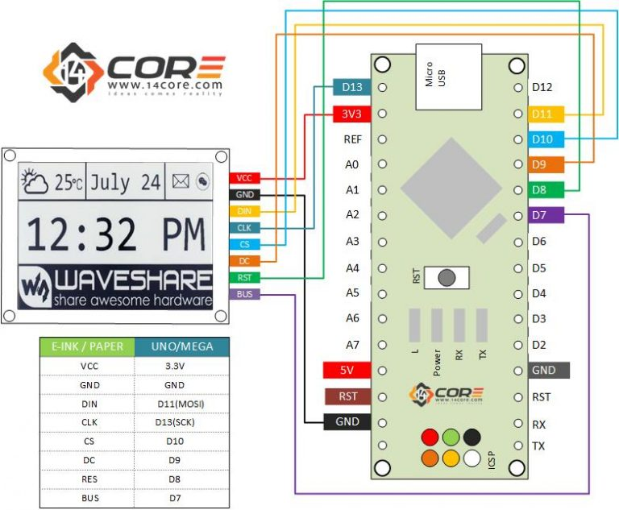

# SwimmingPoolLapCounter

Hardware:
- Arduino Nano
- e-ink MH-ET LIVE - see https://github.com/MHEtLive/MH-ET-LIVE-E-Papers 

Wiring:

| e-ink / paper | Nano board |
|---------------|------------|
| VCC           | 5V         |
| GND           | GND        |
| SDI (DIN)     | D11(MOSI)  |
| CLK           | D13(SCK)   |
| CS            | D10        |
| DC            | D9         |
| RESET         | D8         |
| BUSY          | D7         |

