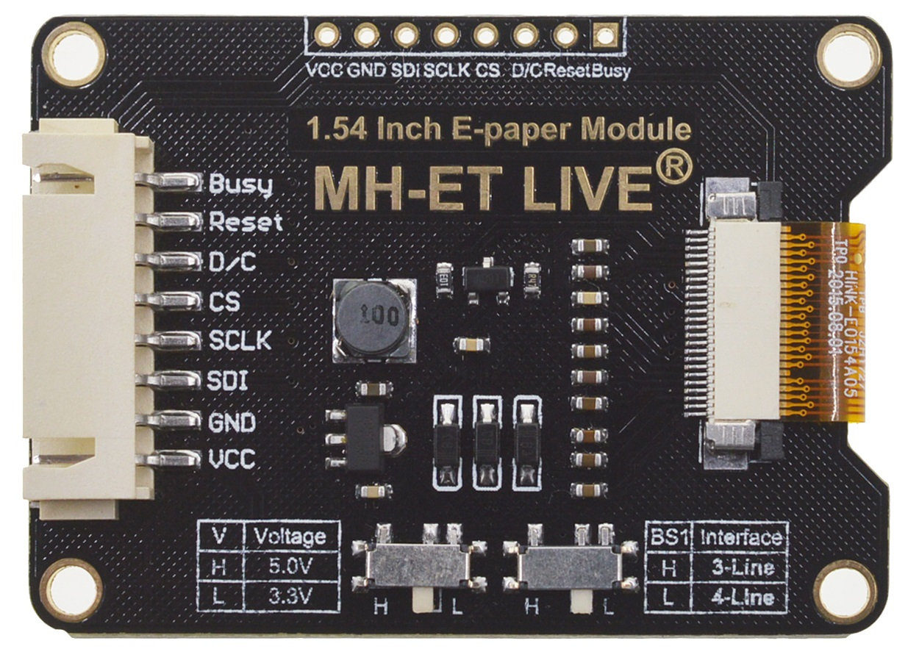

# SwimmingPoolLapCounter

## Hardware:
- Arduino Nano

- e-ink MH-ET LIVE - see https://github.com/MHEtLive/MH-ET-LIVE-E-Papers 
(my only works in 5V mode)

- active buzzer (3.3-5V VCC (2mA when it beeps), GND, IN=3.3V)
 Consider: on/off toggle (hardware switch and maybe 600-1000Ohm variable resistor for VCC to adjust buzzer volume)
 IO pin connected via D4 .

 - red 5mm led (2.2V, 10mA) (nano can output 40mA per IO pin, so it would be ok), connected via 150Ohm resistor to D5

 - small powerbank (with 18650 battery, USB charging input and output - to power the nano and PCB)

## Wiring:

| e-ink / paper | Nano board |
|---------------|------------|
| VCC           | 5V         |
| GND           | GND        |
| SDI (DIN)     | D11(MOSI)  |
| CLK           | D13(SCK)   |
| CS            | D10        |
| DC            | D9         |
| RESET         | D8         |
| BUSY          | D7         |

## User interface

After starting the device the lap count resets to 0.
The capacitive sensor if "pressed" for a short time increments the lap count, emits sound and lights LED.
If "pressed" for a long time (>3 sec) it resets the counter.

Configuration is available by:
- beeper volume - by potentiometer
- LED brightness - by potentiometer
- touch sensing sensitivity threshold - by potentiometer
- touch sensing resistor - by potentiometer / dip switch
- dip switch to set if the increments should be by 1 or 2 laps per button press

## Knows issues:
- the EPD library updates the screen in blocks that are multiplications of 8 pixels, but the RRE fonts lib is using blocks of different sizes. This causes minor glitches in the rendered fonts. Because of that issue I did not even tried to use antialiased fonts.

## TO DO list:
- implement LED
- implement beeper
- implement capacitive touch interface
- implement the 
- add resistors for LEDs (3V => 2.2V and brightness regulation), beeper IO (1k)
- schematics with wiring
- PCB design 
- deep sleep mode (think about user interface for waking up, putting to sleep)
- low battery warning (?)