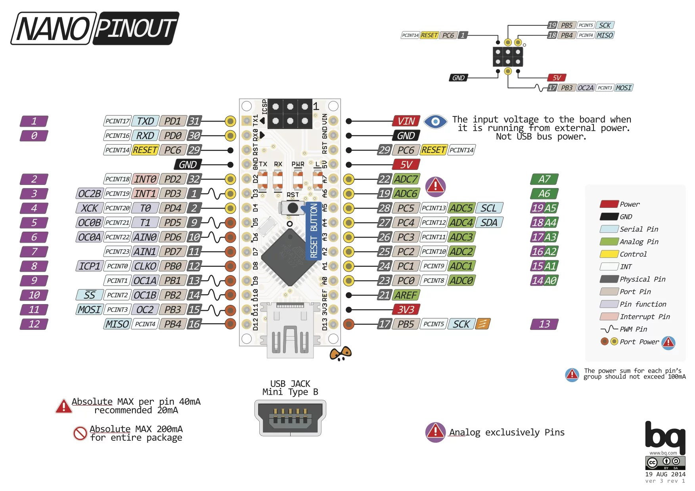

# Swimming Pool Lap Counter

Swimming pool lap counter is a device for swimmers, so when practicing swimming in the pool they can easily count how many laps did they swim. 

The design requirements and solutions:
- battery powered  (powered by single cell 18650 powerbank)
- waterproof (fits into watertight food box)
- easy to trigger count increments (by capacitive touch sensing)
- lap count displayed and visible in bright sunlight (eInk display)
- lap increment trigger acknowledged (by buzzer and led)
- ability to reset counter without opening the box
- configuration should not interfere with main use case (lap count) and should not be triggered by mistake.

## Prototype

The ground wire should be grounded.
The blue wire should be connected to aluminum foil to sense touches.

## User interface

After starting the device the lap count resets to 0.
The capacitive sensor if "pressed" (senses touch) for a short time increments the lap count, emits sound and lights LED.
If "pressed" for a long time (>3 sec) it resets the counter.

Configuration options:
- beeper volume - by potentiometer (1k Ohm)
- LED brightness - by potentiometer (1k Ohm)
- touch sensing sensitivity threshold - by potentiometer (10k Ohm)
- (fixed) touch sensing resistor (20M Ohm) ~~- by potentiometer / dip switch~~ (idea abandoned - in practice dip switch and pot caused too much noise)
- increment counter by 2 mode - dip switch (by default increment by 1)
- 5s minimum lap increment interval - dip switch (by default - about 500ms)

## Hardware:
- Arduino Nano

- e-ink MH-ET LIVE - see https://github.com/MHEtLive/MH-ET-LIVE-E-Papers 
(my only works in 5V mode)

- active buzzer (5V VCC (2mA when it beeps), GND)
 Consider: on/off toggle (hardware switch and maybe 1k-2kOhm variable resistor for VCC to adjust buzzer volume)
 IO pin connected via D4 .

 - red 5mm led (2.2V, 10mA) (nano can output 40mA per IO pin, so it would be ok), connected via 330 Ohm resistor to D5

 - small powerbank (with 18650 battery, USB charging input and output - to power the nano and PCB)

## Wiring:

| e-ink / paper | Nano board |
|---------------|------------|
| VCC           | 5V         |
| GND           | GND        |
| SDI (DIN)     | D11(MOSI)  |
| CLK           | D13(SCK)   |
| CS            | D10        |
| DC            | D9         |
| RESET         | D8         |
| BUSY          | D7         |

## Schematic

## PCB design

PCB is based on prototype board 70 x 50mm with THT components soldered on top and SMD on bottom. 
The SMD resistor can be replaced with THT one in vertical mode.

## Knows issues:
- the EPD library updates the screen in blocks that are multiplications of 8 pixels, but the RRE fonts lib is using blocks of different sizes. This causes minor glitches in the rendered fonts. Because of that issue I did not even tried to use antialiased fonts, but thanks to eInk high resolution the numbers are still readable

## TO DO ideas:
- deep sleep mode (think about user interface for waking up, putting to sleep)
- low battery warning (?)